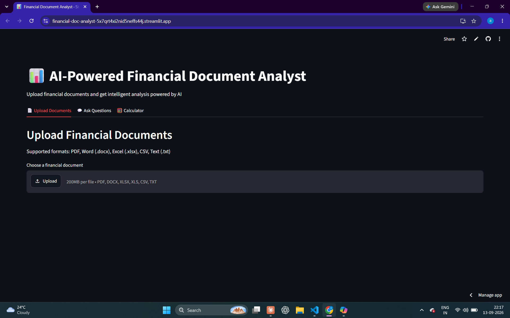

# 📊 AI-Powered Financial Document Analyst

An intelligent document analysis system that lets users upload financial 
documents and get instant answers, structured data extraction, live market 
data, and financial calculations — powered by RAG pipelines and LLM agents.
🖼️ Preview
## Project Preview




## 🎯 Problem Statement

Financial professionals waste hours manually reading 200+ page annual 
reports, loan agreements, and balance sheets to extract key information. 
This system solves that in seconds — with source citations so every 
answer is verifiable.

## ✨ Features

### 📄 Multi-Format Document Support
Upload PDF, Word (.docx), Excel (.xlsx), CSV, or Text files. Scanned 
documents are handled via Groq vision model OCR — no manual text 
extraction needed.

### 💬 Intelligent Q&A with Source Citations
Ask anything about your document. Every answer includes the exact page 
number it came from — critical for financial applications where 
auditability matters.

### 📊 Structured Financial Data Extraction
Extract all financial figures as a clean, structured table instead of 
raw paragraphs. Revenue, profit margins, ratios — organized instantly.

### 📈 Live Market Data Integration
Combine document knowledge with real-time stock prices and market data. 
Ask "Is the interest rate in this document competitive with current 
market rates?" and get a complete answer.

### 🧮 Financial Calculator
Built-in EMI, compound interest, and CAGR calculator. Ask in natural 
language — the agent extracts numbers from the document and calculates 
automatically.

### 🤖 Transparent Agent Reasoning
Every answer shows which tools were called and why — full explainability 
of the AI's decision-making process.

## 🏗️ Architecture
User (Streamlit UI)
  ↓
FastAPI Backend (/upload, /query, /health)
  ↓
Agent Layer (Llama 3.3 via Groq)
Decides which tool(s) to call
  ↓
┌─────────────────────────────────────┐
│ search_documents │ extract_data │
│ get_market_data │ calculate_EMI │
└─────────────────────────────────────┘
  ↓
ChromaDB Vector Store
(chunks + embeddings + page metadata)
  ↓
sentence-transformers (all-MiniLM-L6-v2)
  ↓
PDF/DOCX/XLSX/CSV Input


## 🛠️ Tech Stack

| Component | Technology |
|-----------|------------|
| Frontend | Streamlit |
| Backend | FastAPI + Uvicorn |
| LLM | Llama 3.3 70B via Groq |
| Embeddings | sentence-transformers |
| Vector DB | ChromaDB |
| PDF Parser | PyMuPDF |
| OCR | Groq Vision (qwen3.6-27b) |
| Market Data | yfinance |
| Language | Python 3.11 |

## 🚀 Quick Start

### Prerequisites
- Python 3.11
- Groq API key (free at console.groq.com)

### Installation

```bash
# Clone the repository
git clone https://github.com/Alpana176/financial-doc-analyst.git
cd financial-doc-analyst

# Create virtual environment
python -m venv venv
venv\Scripts\activate  # Windows
source venv/bin/activate  # Mac/Linux

# Install dependencies
pip install -r requirements.txt

# Set up environment variables
echo "GROQ_API_KEY=your_key_here" > .env
```

### Running the Application

```bash
# Terminal 1 — Start FastAPI backend
python backend/main.py

# Terminal 2 — Start Streamlit frontend
python -m streamlit run frontend/app.py
```

Open `http://localhost:8501` in your browser.

## 📁 Project Structure

financial-doc-analyst/
├── backend/
│ ├── ingestion.py # PDF/doc loading, chunking, embedding, storage
│ ├── retrieval.py # RAG question answering
│ ├── tools.py # 4 agent tools (search, extract, market, calc)
│ ├── agent.py # LLM agent with tool routing
│ └── main.py # FastAPI endpoints
├── frontend/
│ └── app.py # Streamlit UI (3 tabs)
├── uploads/ # Uploaded documents
├── vector_store/ # ChromaDB persistent storage
├── requirements.txt
└── .env # API keys (not committed)

## 🔍 How RAG Works in This Project

1. **Ingestion** — PDF is read page by page, text extracted with page 
   number tracking
2. **Chunking** — Text split into 200-word chunks with 20-word overlap
3. **Embedding** — Each chunk converted to a 384-dim vector using 
   sentence-transformers
4. **Storage** — Vectors + metadata (filename, page number) stored in 
   ChromaDB
5. **Retrieval** — User query embedded, top-k similar chunks retrieved
6. **Generation** — Retrieved chunks + query sent to Llama 3.3 for 
   answer generation with source citation

## 🤖 How the Agent Works

The agent uses a two-step routing approach:

1. **Routing** — User question + tool descriptions sent to LLM. LLM 
   decides which tool to call and with what arguments
2. **Execution** — Selected tool runs (document search, market API, 
   calculator, or data extraction)
3. **Generation** — Tool result + original question sent back to LLM 
   for final answer

This enables multi-tool queries: "What interest rate does the document 
mention, and what's my EMI at that rate?" triggers both 
`search_documents` and `calculate_financial_metric` in sequence.

## 📈 Sample Queries
"What is the total revenue of Tata Motors for FY2025?"
→ Searches document, returns answer with page citation

"Extract all key financial ratios from this annual report"
→ Returns structured JSON table of all financial metrics

"Calculate EMI for the loan amount mentioned in this document"
→ Finds loan amount via RAG, calculates EMI with full breakdown

"What is Apple's current stock price?"
→ Fetches live market data via yfinance

## ⚠️ Limitations & Future Improvements

- OCR on free Groq tier has daily token limits (200k tokens/day)
- Complex financial tables with merged cells may lose formatting
- Future: Re-ranking with cross-encoders for better retrieval
- Future: Multi-document comparison with metadata filtering
- Future: Redis caching for repeated queries

## 👩‍💻 Author

**Alpana Choubey**
- GitHub: [@Alpana176](https://github.com/Alpana176)
- LinkedIn: https://www.linkedin.com/in/alpana-choubey-28152422a/

---
⭐ Star this repo if you find it useful!
